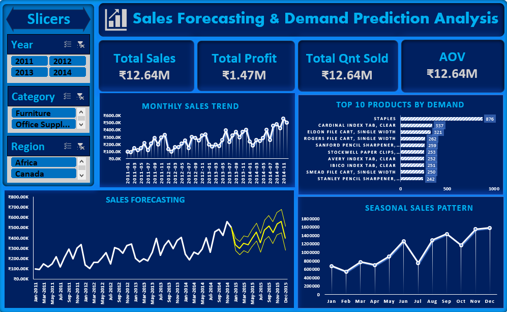

# 📦 Sales Forecasting & Demand Prediction Analysis Dashboard

---

# 📌 Project Overview

This project is **Project 4 of my Internship – Sales Forecasting & Demand Prediction Analysis**.

The project analyzes **51,290 global retail sales records (2011–2014)** to evaluate sales trends, product demand, seasonal patterns, and category profitability entirely within **Microsoft Excel**[cite: 1, 5]. The analysis converts raw historical business data into actionable forecasting insights to optimize future demand planning and resolve critical operational challenges like demand volatility and inventory misallocation.

---

# 🎯 Business Problem

Retail companies often face sudden fluctuations in demand, leading to stockouts during peak seasons or overstocking during off-peak periods. 

This project aims to answer key business questions such as:

- Which months have the highest sales?
- Is there any seasonal pattern in sales?
- What is the overall sales trend (increasing or decreasing)?
- Which products are expected to have high demand in the future?
- How can the company improve demand planning and inventory management?

---

# 📁 Dataset Information

| Attribute | Details |
|---|---|
| Industry | Retail Sales & Demand Forecasting |
| File Format | Excel (.xlsx) |
| Total Records | 51,290 |
| Date Range | 2011 – 2014 |
| Categories | 3 (Technology, Furniture, Office Supplies) |
| Sub-Categories | 17 |
| Analysis Type | Time Series, Seasonal Trend & Profitability Analysis |

### Dataset Columns (Key Features)

- `order_id`, `order_date`, `ship_date`, `ship_mode`
- `customer_name`, `segment`, `country`, `market`, `region`
- `product_id`, `category`, `sub_category`, `product_name`
- `sales`, `quantity`, `discount`, `profit`, `shipping_cost`
- `year`, `Month`, `Month_Name`, 

---

# 🧹 Data Cleaning & Preprocessing

The dataset was rigorously cleaned and prepared in **Excel** before analysis.

- Removed duplicate transaction records
- Handled missing values and standardized text casing
- Formatted date columns correctly to extract `Year`, `Month`, `Quarter`, and `Day`
- Ensured numeric columns (`sales`, `profit`, `discount`) were correctly formatted as currency/numbers
- Prepared calculated fields and aggregated metrics for the dashboard

---

# 🛠 Tools & Techniques

- **Microsoft Excel** (Exclusively Used)
- Advanced Data Cleaning
- Data Analysis
- Pivot Tables & Pivot Charts
- Slicers & Timelines
- KPI Cards Development
- Time Series & Trend Analysis
- Dashboard Design & Data Visualization

---

# 📊 Dashboard KPIs

The analysis tracks important business metrics across the 4-year period:

- 🛍️ **Total Orders:** 25,035
- 📦 **Total Units Sold:** 178,312
- 💰 **Total Revenue:** ₹12,642,905
- 📈 **Total Profit:** ₹1,469,034
- 🚚 **Average Shipping Cost:** ₹26.38

---

# 📈 Business Analysis

The dashboard focuses on the required expected analysis:

- Monthly and Yearly Sales Trends
- Product-wise and Category-wise Sales Performance
- Seasonal Demand Patterns (Peaks and Troughs)
- Growth or decline in sales over time

---

# 💡 Key Insights

Based on the cleaned dataset and Excel analysis:

- 🏆 **November (₹1,551,319) and December (₹1,580,816)** generate the highest monthly sales revenue, representing the peak Q4 season.
- 📈 The business shows a **strictly increasing year-over-year sales trend**, growing from ₹2.26M in 2011 to ₹4.30M in 2014.
- 💻 **Technology** generates the highest product category revenue at **₹4,744,691** and the highest profit at **₹663,778**.
- 📉 **February (₹543,768)** is the lowest sales month, acting as an annual off-peak trough.
- 📱 The **Phones** sub-category shows top sales momentum, generating **₹1,706,874** in total revenue.

---

# 💼 Business Recommendations

Based on the analysis:

- 📦 **Dynamic Supply Chain Stocking:** Scale up procurement and inventory intake during July and August to stay ahead of the massive Q3–Q4 peak season, preventing stockouts during November and December.
- 🏷️ **Targeted Off-Peak Promotional Campaigns:** Introduce promotional bundles, volume rebates, or corporate loyalty incentives during January and February to stabilize cash flows during lower demand months.
- 💰 **Prioritize High-Margin Technology Lines:** Expand marketing initiatives around high-value smart phones and advanced copiers to maximize operating margin percentage.

---

# 🎯 Project Evaluation & Deliverables

### 📦 Project Deliverables
- ✅ Dataset (self-collected or generated)
- ✅ Cleaned Data File
- ✅ Analysis File (Excel)
- ✅ Dashboard (Excel)
- ✅ Final Insights & Recommendations Summary

### ⚖️ Evaluation Criteria
The project was evaluated based on the following breakdown:
- 📥 **Data Collection & Relevance:** 10%
- 🧹 **Data Cleaning:** 20%
- 🔍 **Data Analysis:** 25%
- 📊 **Dashboard Development:** 25%
- 💡 **Insights & Recommendations:** 20%

---

# 📷 Dashboard Preview

> Add your Excel dashboard screenshot below.

---

# 🚀 Skills Demonstrated & Gained

Completing this project developed strong competencies in:
- 🧹 **Data Cleaning Skills:** Preparing raw data for accurate analysis.
- 🔍 **Data Analysis Skills:** Utilizing Excel formulas, Pivot Tables, and logic.
- 📅 **Time Series & Trend Analysis:** Uncovering cyclical patterns and revenue trajectories.
- 🏢 **Business Understanding:** Bridging the gap between raw numbers and retail inventory strategy.
- 🎨 **Dashboard Creation Skills:** Building interactive, visually appealing executive tools.

🔮 Future Enhancements

- Add automated data refresh using Power Query
- Build an advanced Power BI dashboard
- Connect the dashboard with a SQL database
- Add demand and inventory forecasting

---

# 👨‍💻 Author

**Manish Kashyap**

🎓 B.Tech CSE | AI, ML & Deep Learning  
📊 Aspiring Data Analyst

---

⭐ If you found this project useful, feel free to star the repository.

├── Insights_and_Recommendations.docx
└── README.md
